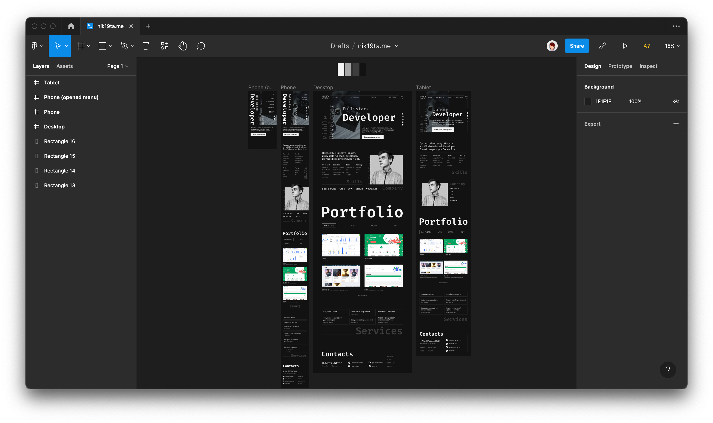

# nik19ta.me

## About the project

my site on next

Tools
- Lang - TypeScript
- Framework - NextJs
- For multilingual - i18n
- For CI/CD - GitHub Actions

 

- You can wiew [site](https://nik19ta.github.io/nik19ta.me/) on github pages
- You can wiew figma (image - link)

## How to run

### Start for local development

- Get packages `npm i`
- Start `npm run dev`